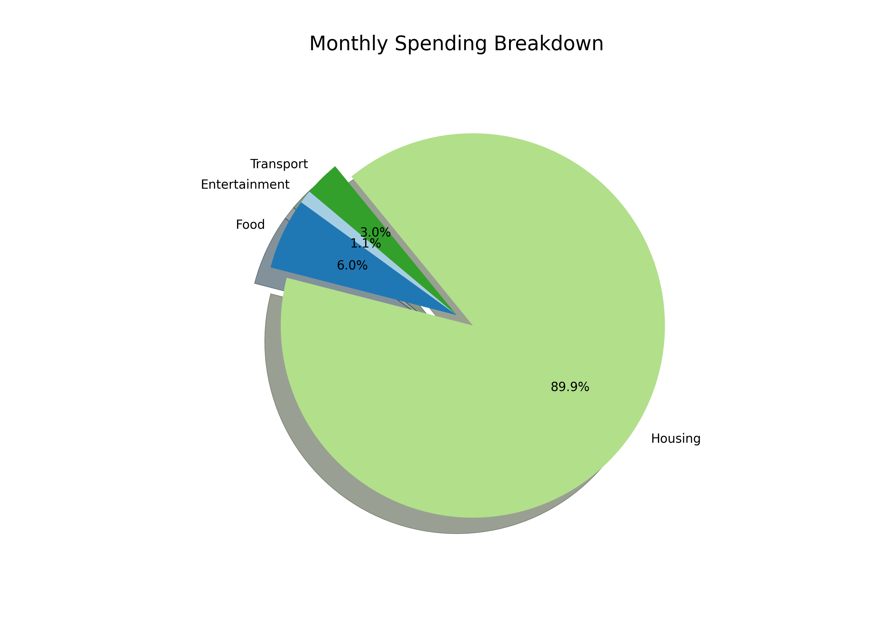

# Project Documentation: Personal Finance Tracker

## 1. Overview

This application is a data analysis tool designed to process personal financial records. It allows users to upload transaction history in CSV format, performs automated financial calculations, and generates high-quality visual reports to track spending habits.

## 2. Technical Components

* **Data Analysis**: Uses the **Pandas** library for filtering income/expenses and grouping data by category.
* **GUI Selection**: Implements `tkinter.filedialog` to allow users to browse and select their transaction files without editing the source code.
* **Visualization**: Utilizes **Matplotlib** with the `ggplot` style to create professional-grade pie charts.
* **Error Handling**: Features a `try-except` block to manage corrupted files or incorrect data formats safely.

---

## 3. Data Format Guide (CSV)

To ensure the script runs correctly, your input file must follow this specific structure:

| Date | Description | Amount | Category |
| --- | --- | --- | --- |
| 2026-01-01 | Grocery Store | -50.00 | Food |
| 2026-01-05 | Salary | 3000.00 | Income |
| 2026-01-10 | Rent | -1200.00 | Housing |

---

## 4. Code Logic Breakdown

### A. User Input and Validation

* **File Picker**: Launches a native OS file picker filtered specifically for `.csv` files using `askopenfilename`.
* **Empty Selection Check**: If no file is selected, the script terminates gracefully to prevent execution errors.

### B. Financial Analysis

* **Boolean Indexing**: The script separates income from expenses by checking if the `Amount` is greater than or less than zero.
* **Aggregation**: Uses `.groupby('Category')` to sum up total spending for each distinct category.
* **Standardization**: Applies `.abs()` to ensure expense values are positive for cleaner visualization.

### C. Visual Reporting

* **Styled Plotting**: Uses `plt.style.use('ggplot')` and the `Paired` color map for a professional aesthetic.
* **The Explode Effect**: Dynamically identifies the largest expense category and "explodes" (separates) it from the pie for emphasis.
* **Persistence**: Saves the resulting chart as a high-resolution (300 DPI) PNG file named `spending_chart.png`.

---

## 5. User Guide

1. **Prepare Data**: Ensure your bank statement is in CSV format with columns titled `Amount` and `Category`.
2. **Run Script**: Execute `python tracker.py`.
3. **Select File**: Use the pop-up window to find your CSV file.
4. **Review Summary**: Check the terminal for Total Income, Expenses, and Savings.
5. **View Chart**: An interactive pie chart will appear; a copy is automatically saved to your project folder.
